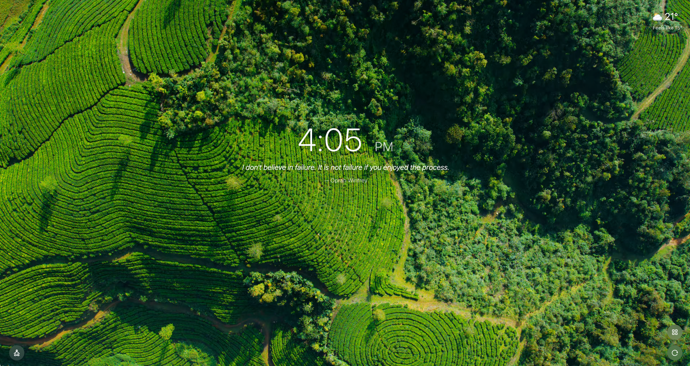

# Macify — macOS Aerial Screensavers in Chrome's New Tab


Replace Chrome's new tab page with macOS's aerial screensaver videos and a small set of calm, optional widgets. macOS is **not** required — videos are streamed from Apple's CDN and play in any platform that runs Chrome.



## Features

- 🎥 **156 aerial videos** in 4K SDR, sourced from Apple's current macOS catalog (Landscapes, Cities, Underwater, Space, and more).
- 🌤️ **Live weather** — current temperature, "feels like", 3-day forecast, sunrise/sunset, UV, wind, air quality. Powered by [Open-Meteo](https://open-meteo.com/), no API key required.
- 📌 **Top sites** widget pulled from Chrome's built-in list (no history permission needed).
- 💬 **Random quotes** from a curated 500-entry public-domain set.
- 🧘 **Zen mode** — fullscreen the video with optional ambient music.
- 🔤 **4 languages** — English, 简体中文, 繁體中文, 日本語.

## Install

[Install from Chrome Web Store](https://chromewebstore.google.com/detail/macify-macos-screensaver/lgdipcalomggcjkohjhkhkbcpgladnoe).

Or load unpacked: see [Building from source](#building-from-source).

## Choosing a video source

Three options. Each section in the extension's settings page also includes a built-in step-by-step setup guide — this README only summarises.

### 1. Apple Server (default)

Streams directly from `sylvan.apple.com`. Chrome may not trust Apple's certificate by default; two ways to fix it:

**Option A — Reverse proxy (default on, easiest).** Video requests are routed through a hosted Cloudflare Worker that handles the certificate dance. Zero local setup. Convenient but should not be relied on long-term — set up local hosting or trust the cert when possible.

**Option B — Trust Apple's cert manually (cleanest).** Visit [https://sylvan.apple.com](https://sylvan.apple.com) once in Chrome. You'll see a security warning — click "Advanced", then "Proceed to sylvan.apple.com (unsafe)". Chrome remembers the trust and direct connection works thereafter.


### 2. Local Apache server (recommended for macOS users)

For best performance and zero third-party dependency, host the videos yourself on macOS's own Apache.

#### Step 1 — Download the videos

Open System Settings → Screen Saver → Aerial. Click each video you want to download (each is 500MB–1GB). Downloads can be slow and may need retries.


#### Step 2 — Configure Apache

Save the following as `videoserver.conf`, replacing `YOUR_MAC_USER_NAME` with your actual macOS username:

```apache
LoadModule headers_module libexec/apache2/mod_headers.so

User YOUR_MAC_USER_NAME
Group staff

Listen 18000

<VirtualHost *:18000>
    Header always set Access-Control-Allow-Origin "*"
    Alias /videos "/Users/YOUR_MAC_USER_NAME/Library/Application Support/com.apple.wallpaper/aerials/videos"

    <Directory "/Users/YOUR_MAC_USER_NAME/Library/Application Support/com.apple.wallpaper/aerials/videos">
        Options +Indexes
        Require all granted
    </Directory>
</VirtualHost>
```

Symlink it into Apache's drop-in folder and restart:

```bash
sudo ln -s /path/to/videoserver.conf /private/etc/apache2/other
sudo apachectl restart
```

#### Step 3 — Point Macify at it

In Macify settings, switch the source to **Local server** and confirm the URL is `http://localhost:18000/videos/`.

## Permissions

Macify requests three permissions, all non-sensitive:

| Permission | Used for |
|---|---|
| `storage` | Persist user preferences and cache weather data. |
| `topSites` | Read Chrome's most-visited list for the Top Sites widget. |
| `favicon` | Show favicons next to Top Sites entries (uses Chrome's built-in cache; no external network). |

No `history` permission. No host permissions for arbitrary sites.

## Building from source

Requirements: Node.js 20+ and npm.

The build is **not zero-config** — Macify needs a CDN you control for the Apple aerial reverse proxy and the zen-mode music. The published Chrome Store build uses my own infrastructure; if you fork, you bring your own. The build refuses to run without these set.

### 1. Stand up your CDN host

Pick a single hostname you control, sitting behind Cloudflare. The same hostname serves two paths:

| Path | Backed by |
|---|---|
| `<host>/itunes-assets/*` | A Cloudflare Worker (see [`cloudflare-worker/worker.js`](cloudflare-worker/worker.js)) reverse-proxying `sylvan.apple.com` |
| `<host>/music/musicNNNNN.mp3` | An R2 bucket containing 40 zen-mode music files (`music00001.mp3` … `music00040.mp3`) bound to the same hostname |

#### Worker setup

1. Cloudflare dashboard → Workers & Pages → Create Worker → paste [`cloudflare-worker/worker.js`](cloudflare-worker/worker.js) → Deploy.
2. Settings → Triggers → Add Custom Domain or Route → `<host>/itunes-assets/*`.

**Optional anti-abuse layer.** If you want to keep random callers off your worker, add a Cloudflare WAF rule:

- Security → WAF → Custom Rules → Create rule:
  - Match: `URI Path starts with "/itunes-assets/"` AND `URI Query String does not contain "k=<your-token>"`
  - Action: Block
- Generate the token with `openssl rand -hex 16` and set it as `VITE_APPLE_PROXY_KEY` (next section). The build appends `?k=<token>` to every video request.

Skip this if you don't care — the worker still works.

#### Music R2 bucket

1. Create an R2 bucket and bind it to your `<host>` as a custom domain.
2. Upload your 40 audio files as `music/music00001.mp3` … `music/music00040.mp3`. Macify itself doesn't ship music — pick anything calm and ambient (royalty-free or your own).

### 2. Set the build env

```bash
git clone https://github.com/jason5ng32/Macify.git
cd Macify
cp .env.example .env
# edit .env — fill in VITE_MACIFY_BASE (required)
# and VITE_APPLE_PROXY_KEY (only if you set up the WAF rule above)
npm install
npm run build
```

If `.env` is missing or incomplete the build aborts with a list of what's missing. See [`.env.example`](.env.example) for the full reference.

### 3. Load the extension

The built extension is in `dist/`. Chrome → `chrome://extensions` → Developer mode → "Load unpacked" → select `dist/`.

## Contributing

PRs welcome — bug fixes, translations, new aerial-source adapters, performance improvements, accessibility fixes.

## License

MIT. See [LICENSE](LICENSE).

## Credits

Created by Jason Ng, Dofy, Setilis. Aerial videos are © Apple Inc.
